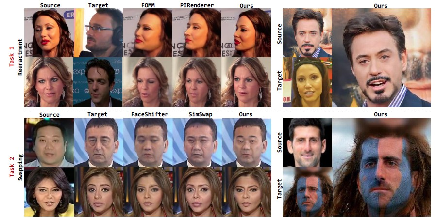

## Designing One Unified Framework for High-Fidelity Face Reenactment and Swapping
This repository contains the official PyTorch implementation of the paper *Designing One Unified Framework for High-Fidelity Face Reenactment and Swapping* (ECCV2022).



## Using the Code

### Requirements
```
conda create -y -n uniface python=3.6.12
conda activate uniface
./install.sh
```

### Data
Please download CelebA-HQ in `data`.

Please download VoxCeleb2 in `data` and follow the instrcution in [FOMM](https://github.com/AliaksandrSiarohin/first-order-model) official repository to perform preprocessing.

### Inference
Please put test images to `examples` and create `pair.txt` to indicate the source and target file names. For example, `001_002` means the source file name is `001` and the target is `002`.
Please put pre-trained models in `session`.

For pre-trained models, since Deepfakes involves social impacts and ethical problems, anyone who requires for pre-trained models need to [send a request email](mailto:21832066@zju.edu.cn) with subject "APPLY FOR MODELS" to us and describe **in detail** about your personal information and purpose, and must follow strict ethical standards. We will take a zero-tolerance approach to anyone using our work for unethical purposes and actively discourage any such uses.

```
git clone https://github.com/xc-csc101/UniFace
python generate_swap.py   # test for swapping
python generate_reenact.py   # test for reenactment
```

### Train
```
python train_reenact.py  # train for reenactment
python train_swap.py    # train for swapping
```

### Acknowledgements
Our project is built on the [StyleMapGAN](https://github.com/naver-ai/StyleMapGAN) and some codes are borrowed from [pSp](https://github.com/eladrich/pixel2style2pixel). We thank the authors for their excellent work.